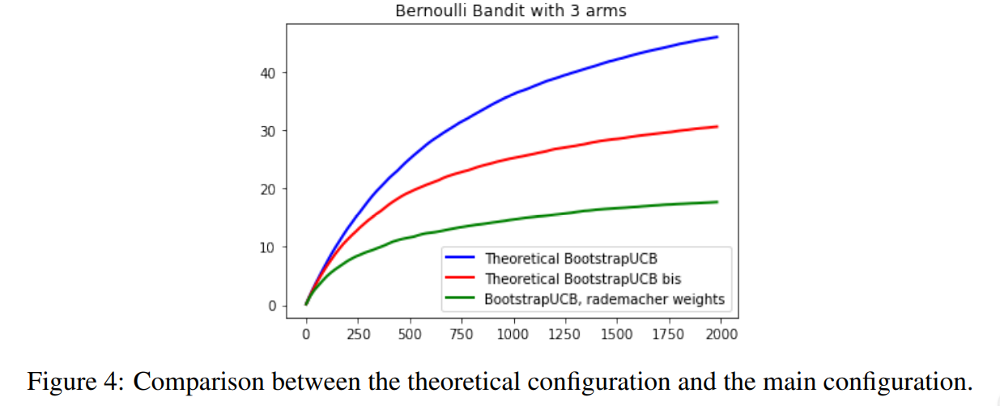

# Bootstrapping Multi-Armed Bandits

[Imad AOUALI](https://www.linkedin.com/in/imad-aouali/)

## Abstract

Multi-Armed bandits have attracted a lot of attention in various applications, from recommender systems and information retrieval to healthcare and finance, due to their performance, their simplicity and properties such as learning from partial feed back. Bootstrapping is a powerful, computer-based method for statistical inference. It is a resampling method which samples independently with replacement from an existing sample data with same sample size n, and performing inference among these resampled data. Two recent papers proposed Bootstrap-based approaches for multi-armed bandit problems. This project aims to provide a comprehensive review of the use of Bootstrapping in multi-armed bandit problems by contrasting those approaches and discussing their benefits compared to traditional bandit approaches like UCB, kl-UCB, and Thompson Sampling.

## Repository Structure

This repository consists in three directories with specific purposes:

- `documents`: This directory contains 2 papers proposing the use of bootstrapping techniques for Bandit problems.
  1. `Bootstrapping Upper Confidence Bound`
  2. `Giro Bootstrapping Exploration in Multi-Armed Bandits`
- `codes`:
  1. `Bootstrapping_MAB.ipynb`: Implementation from scratch of traditional bandit approaches UCB, kl-UCB, Thompson Sampling. Implementation of Boostrapped UCB, Giro and UCB0 (A UCB variant that I proposed). Comparison on different Bandit problems.
  2. `Arms.py`: Different classes of arms, all of them have a sample() method which produce rewards.
  3. `BanditBaselines.py`: Two bandit baselines.
  4. `BanditTools.py`: Useful functions for bandit algorithms.
  5. `StochasticBandit.py`: Useful functions that create specific types of MAB.
- `images`: Contains some of the results obtained by running the notebook.

## Results

#### Bootstrapped UCB and Giro Compared to Traditional Approaches

#### Influence of Parameters

#### Comparison of the Theoretical and Experimental Configurations of Boostrapped UCB

#### UCB0 Compared to Giro and Bootstrapped UCB

For any information, feedback or questions, please [contact me][imad-email]

[imad-email]: mailto:imadaouali9@gmail.com 
